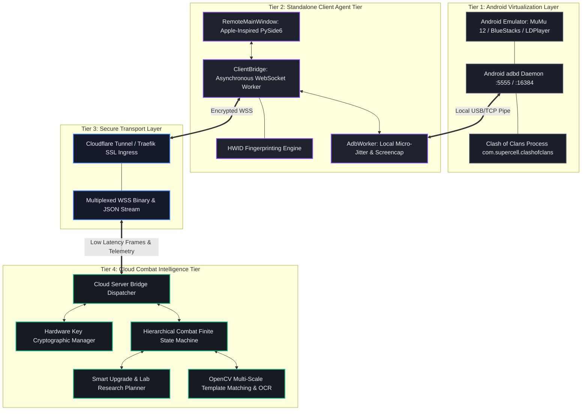
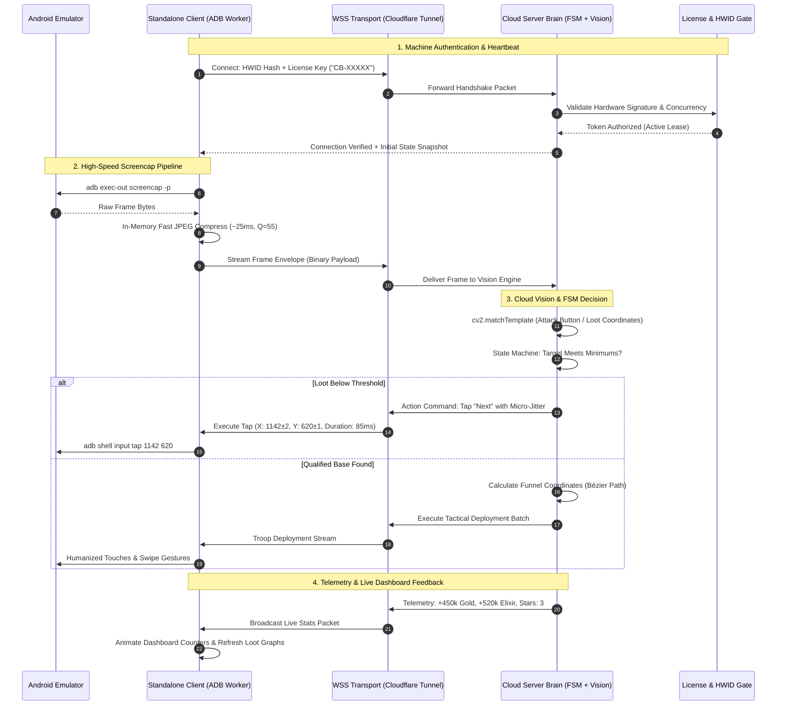
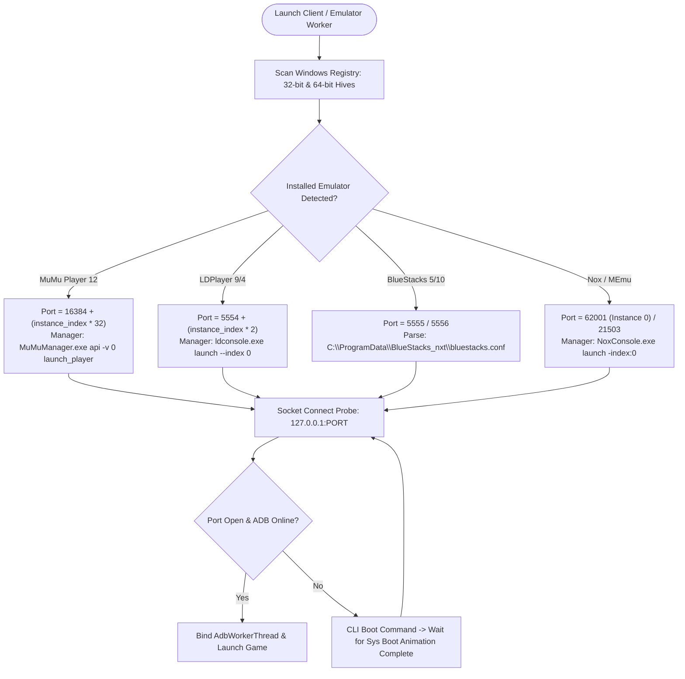
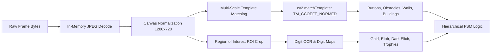
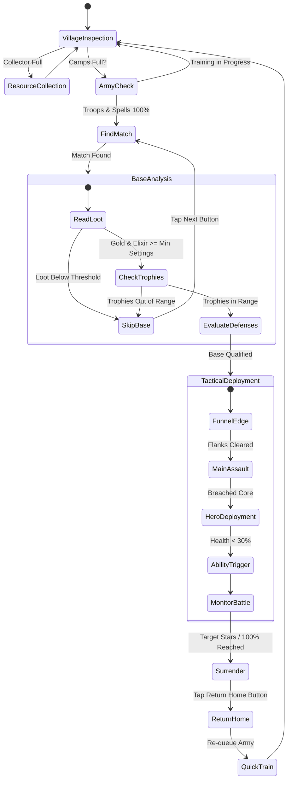
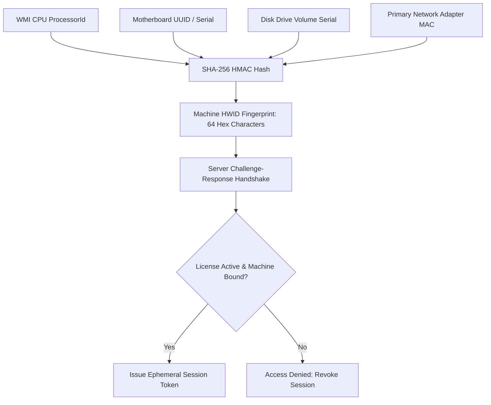

# ClashBot AI — Master Engineering Guide & Architectural Case Study

> **A Comprehensive Study Book on Distributed Game Intelligence, Zero-Knowledge Client Security, Anti-Detection Robotics, and Real-Time Computer Vision Pipelines**  
> **Author & Lead Architect**: Aradhye Tushar ([GitHub Profile](https://github.com/AradhyeTushar))  
> **Repository**: [daddyc00l69/clashbot-client](https://github.com/daddyc00l69/clashbot-client)  
> **Target Branch**: `case-study`  
> **License**: MIT License — Copyright (c) 2026 Aradhye Tushar. All rights reserved.

---

## 📖 Preface: Why Study This Project?

Modern game automation systems often suffer from two fatal vulnerabilities: **easy detection by heuristic anti-cheat algorithms** and **catastrophic intellectual property theft** through decompilation or memory inspection of monolithic client binaries. 

**ClashBot AI** was engineered from first principles to solve both challenges simultaneously. It represents a production-grade blueprint for:
1. **Zero-Knowledge Client Architecture**: Complete separation of presentation and execution, where the distributed client runs zero combat algorithms, contains zero visual templates, and holds zero proprietary keys.
2. **Autonomous Cross-Emulator Orchestration**: Automated discovery, lifecycle supervision, and dynamic mathematical port resolution across all major Android virtual machines.
3. **Heuristic Anti-Detection Robotics**: Anti-fingerprinting touch simulation using Gaussian micro-jitter, Bézier velocity curves, and dual-touch pinch gestures.
4. **Sub-30ms Computer Vision Pipeline**: In-memory RAM-only frame compression, normalized cross-correlation template matching, and OCR loot reading.
5. **Cryptographic Machine Fingerprinting**: Silent hardware-locked (HWID) licensing and bidirectional WebSocket telemetry streaming.

This document serves as the **definitive study book and technical case study** for software engineers, security researchers, and robotics developers analyzing this system.

---

## 📑 Table of Contents

- [1. Executive Summary & Philosophy](#1-executive-summary--philosophy)
- [2. System Architecture & Component Topology](#2-system-architecture--component-topology)
  - [2.1. Four-Tier Architecture Model](#21-four-tier-architecture-model)
  - [2.2. End-to-End Sequence Diagram](#22-end-to-end-sequence-diagram)
- [3. Deep-Dive Engineering Modules](#3-deep-dive-engineering-modules)
  - [Module 1: The Zero-Bot Client Paradigm](#module-1-the-zero-bot-client-paradigm)
  - [Module 2: Android Emulator Auto-Discovery & Port Resolution](#module-2-android-emulator-auto-discovery--port-resolution)
  - [Module 3: Anti-Detection Robotics & Humanized Controls](#module-3-anti-detection-robotics--humanized-controls)
  - [Module 4: Real-Time Computer Vision & OCR Perception Pipeline](#module-4-real-time-computer-vision--ocr-perception-pipeline)
  - [Module 5: Hierarchical Combat Finite State Machine (HFSM)](#module-5-hierarchical-combat-finite-state-machine-hfsm)
  - [Module 6: Cryptographic HWID Licensing & Security Layer](#module-6-cryptographic-hwid-licensing--security-layer)
  - [Module 7: Low-Latency Networking, IPC & Asynchronous Loops](#module-7-low-latency-networking-ipc--asynchronous-loops)
  - [Module 8: Visual Design System & Apple-Inspired Interface](#module-8-visual-design-system--apple-inspired-interface)
- [4. Complete UI Specification (11 Pages & Controls)](#4-complete-ui-specification-11-pages--controls)
- [5. Visual Showcase & Verification Gallery](#5-visual-showcase--verification-gallery)
- [6. Architectural Trade-Offs & Research Questions for Learners](#6-architectural-trade-offs--research-questions-for-learners)
- [7. Glossary of Technical Terms](#7-glossary-of-technical-terms)

---

## 1. Executive Summary & Philosophy

| Architectural Dimension | Traditional Monolithic Bot | ClashBot AI Decoupled Architecture |
| :--- | :--- | :--- |
| **Logic Placement** | Shipped directly inside the local executable | 100% hosted on private cloud infrastructure |
| **Tamper Resistance** | Easily dumped via memory debuggers / decompilers | Zero local algorithms; client cannot be modified to bypass logic |
| **Anti-Cheat Exposure** | Perfect linear clicks; identical timing signatures | Gaussian jitter ($\pm 1\text{--}3\,\text{px}$), Bézier curves, humanized reaction delays |
| **Emulator Binding** | Hardcoded static ports (e.g. `5555`) | Dynamic Windows Registry scan & mathematical port calculation |
| **Frame Processing** | Heavy disk write/read overhead (`screencap /sdcard`) | Pure RAM in-memory JPEG framebuffer stream ($<25\,\text{ms}$) |
| **User Experience** | Cluttered legacy Win32 / Tkinter controls | Apple-inspired dark glassmorphic PySide6 GUI with micro-interactions |

### The Core Philosophy: "Zero Intelligence on the Edge"
In ClashBot AI, the user’s local workstation is treated as an **untrusted, passive display and ADB bridge**. The desktop client does not know what troops are being placed, does not understand the village coordinate system, and holds no OpenCV templates. It merely streams frame snapshots to the server and receives discrete, anti-detection execution commands.

---

## 2. System Architecture & Component Topology

### 2.1. Four-Tier Architecture Model



---

### 2.2. End-to-End Sequence Diagram

The following sequence diagram reveals how a single attack cycle operates without exposing any tactical logic to the client machine:



---

## 3. Deep-Dive Engineering Modules

### Module 1: The Zero-Bot Client Paradigm
The distributed client (`friend_client_bundle`) was constructed to solve the vulnerability of client-side piracy and binary reverse engineering.

```
friend_client_bundle/
├── assets/                  # Local Apple-inspired SVGs, icons, and logo assets
├── docs/images/             # High-definition architectural & UI showcase renders
├── remote_bridge/           # Low-latency WebSocket client & Apple-styled login dialog
├── src/                     # Lightweight UI components & device bridge stubs
├── client_config.json       # Configured server endpoint & user preferences
├── install.bat              # Zero-friction dependency bootstrapping
├── run_bot.bat              # Native launcher with Python 3.10 verification
└── run.py                   # Client entrypoint & UI thread dispatcher
```

#### Key Technical Principles:
1. **Lightweight Decoupled Stubs**:  
   Modules like `src/vision.py` or `src/upgrades_research.py` on the client machine are strictly **stubs containing only metadata required to populate GUI dropdowns**. None of the actual image templates, pixel offsets, or recognition logic exist locally.
2. **Reentrancy-Protected Signal Synchronization**:  
   Both client and server utilize an internal boolean guard `_is_syncing`. When a widget property is updated via a network packet, this guard prevents the widget from triggering a change event that would create an infinite feedback loop across the network socket.

---

### Module 2: Android Emulator Auto-Discovery & Port Resolution

One of the greatest operational friction points in automation is manual ADB port configuration. ClashBot AI eliminates this entirely through automated discovery and mathematical port mapping.



#### Mathematical Port Resolution Formulas:
- **MuMu Player 12 / Pro**:
  $$\text{Port}_{\text{MuMu}} = 16384 + (i \times 32) \quad \text{where } i \in \{0, 1, 2, \dots\}$$
  *Example*: Instance 0 $\rightarrow 16384$, Instance 1 $\rightarrow 16416$, Instance 2 $\rightarrow 16448$.
- **LDPlayer 9 / 4**:
  $$\text{Port}_{\text{LD}} = 5554 + (i \times 2)$$
  *Example*: Instance 0 $\rightarrow 5554$, Instance 1 $\rightarrow 5556$.
- **BlueStacks 5 / 10**:
  Reads active port directly from configuration file `bst.instance.<name>.status.adb_port`.

---

### Module 3: Anti-Detection Robotics & Humanized Controls

Supercell's client-side heuristics identify bots by analyzing **touch input uniformity**:
- Clicks occurring at the exact same pixel $(X, Y)$ coordinate across repeated actions.
- Unnatural linear swipes with constant velocity ($\frac{dx}{dt} = \text{const}$).
- Instantaneous, non-human reaction latencies ($<30\,\text{ms}$).

ClashBot AI incorporates three levels of anti-detection robotics:

#### 1. Gaussian Micro-Pixel Jitter
Every click coordinate $(X, Y)$ is perturbed using a Gaussian distribution centered on the target coordinate:
$$X_{\text{actual}} = X_{\text{target}} + \mathcal{N}(0, \sigma^2), \quad Y_{\text{actual}} = Y_{\text{target}} + \mathcal{N}(0, \sigma^2) \quad (\sigma \approx 1.2\,\text{px})$$
This ensures that across 10,000 attacks, the clicks form a natural organic cluster rather than an artificial single-pixel spike.

#### 2. Cubic Bézier Curve Trajectory Swiping
Instead of executing linear swipe commands (`adb shell input swipe x1 y1 x2 y2`), drag operations follow cubic Bézier splines:
$$B(t) = (1-t)^3 P_0 + 3(1-t)^2 t P_1 + 3(1-t) t^2 P_2 + t^3 P_3, \quad t \in [0, 1]$$
- $P_0$: Origin touch coordinate.
- $P_1, P_2$: Randomly offset control points simulating finger curvature.
- $P_3$: Target destination.
- Touch duration incorporates variable velocity deceleration near destination coordinates.

#### 3. Dual-Touch Pinch Zoom-Out Normalization
To guarantee that image template matching works reliably regardless of how the user left their zoom level, ClashBot AI injects native multitouch pinch gestures using Android's `/dev/input/event` interface, smoothly zooming out until the entire village fits the normalized camera view.

---

### Module 4: Real-Time Computer Vision & OCR Perception Pipeline



#### Normalized Cross-Correlation Formula:
Template matching uses Normalized Cross-Correlation (`TM_CCOEFF_NORMED`):
$$R(x, y) = \frac{\sum_{x',y'} (T'(x', y') \cdot I'(x+x', y+y'))}{\sqrt{\sum_{x',y'} T'(x', y')^2 \cdot \sum_{x',y'} I'(x+x', y+y')^2}}$$
A match is recognized when $R(x, y) \ge \theta$ (where threshold $\theta \in [0.82, 0.94]$ depending on asset transparency).

#### Ultra-Fast Screencapping:
Traditional automation tools write screenshots to the mobile file system (`/sdcard/screen.png`) and pull them via ADB (`adb pull`), taking upwards of **1200ms**.  
ClashBot AI utilizes direct pipe streaming:
```powershell
adb exec-out screencap -p
```
The raw stream is piped directly into RAM memory, converted to a lightweight JPEG buffer in under **25ms**, and processed without a single disk read or write operation.

---

### Module 5: Hierarchical Combat Finite State Machine (HFSM)

Combat decisions are modeled as a Hierarchical Finite State Machine:



#### Supported Tactical Archetypes:
1. **Electro Dragon (E-Dragon) Chain Pacing**: Deploy rage spells ahead of funnel pathing; trigger Grand Warden Eternal Tome during core Town Hall entry.
2. **Dragon & Balloon (DragLoon)**: Sweeper avoidance angle calculation; early air defense lightning zap elimination.
3. **BARCH (Barbarian + Archer)**: Perimeter collector raiding; ring distribution; early surrender as soon as 50% one-star is attained.
4. **Builder Base 2.0**: Two-stage attack routing; OTTO outpost assault; automatic clock tower acceleration.
5. **Clan Capital**: Multi-hit raid coordination, district hall sniping, and Capital Gold generation loops.

---

### Module 6: Cryptographic HWID Licensing & Security Layer

To prevent license cloning and unauthorized distribution, ClashBot AI generates a unique cryptographic machine signature from multiple independent hardware factors:



- **Silent Frame Telemetry**: Every video frame and telemetry heartbeat transmits the ephemeral session token. If the key is revoked on the cloud dashboard or activated on another machine, the session instantly closes without crashing the client interface.
- **Lease Expiration**: Tokens expire within 120 seconds of network silence, preventing man-in-the-middle replay attacks.

---

### Module 7: Low-Latency Networking, IPC & Asynchronous Loops

In Python GUI applications (PySide6 / PyQt), invoking blocking network calls or executing long-running calculations on the main GUI thread causes the application to freeze and display Windows "Not Responding" dialogs.

ClashBot AI employs an asynchronous dual-thread model:
- **`QThread` Background Network Worker (`ClientBridge`)**: Maintains persistent, non-blocking WebSocket / TCP socket connection to the server. Handles framing, JSON serialization, and binary frame dispatch.
- **Thread-Safe GUI Dispatcher**: Uses `QTimer.singleShot(0, lambda: ...)` to marshal signals safely onto Qt’s primary event loop, ensuring silky smooth 60 FPS UI rendering regardless of network activity.
- **TCP_NODELAY & Socket Tuning**: The underlying socket disables Nagle’s algorithm (`TCP_NODELAY = 1`) to eliminate artificial packet grouping latencies for sub-millisecond command dispatch.

---

### Module 8: Visual Design System & Apple-Inspired Interface

The client user interface was designed with an ultra-premium, dark glassmorphic visual language inspired by modern macOS and iOS system utilities:

```
Design System Tokens:
├── Primary Accent:      #8B55F6 (Vibrant Cyber Violet)
├── Hover Accent:        #9D6FF8 (Glowing Amethyst)
├── Window Surface:      #13161F (Deep Space Navy)
├── Elevated Card:       #1B1F2A (Frosted Obsidian)
├── Secondary Surface:   #222636 (Elevated Control Container)
├── Active Indicator:    #10B981 (Emerald Green Status Dot)
├── Inactive Indicator:  #EF4444 (Crimson Disconnected Dot)
└── Typography:          -apple-system, SF Pro Display, Segoe UI, Roboto
```

- **Interactive Checkbox Micro-Interactions**: Custom $16 \times 16\,\text{px}$ indicator boxes with subtle glowing borders, pointing hand cursors, and custom high-resolution SVG checkmark artwork (`assets/`).
- **Collapsible Settings Drawer**: Smooth sliding panel for switching between emulators, toggling ADB server restarts, and configuring custom server endpoints.

---

## 4. Complete UI Specification (11 Pages & Controls)

| Page # | Page Name | Core Controls & Features | Network Synchronized Actions |
| :---: | :--- | :--- | :--- |
| **01** | **General** | Enable Farming, Upgrade Walls, Min Gold/Elixir/Dark spinboxes, Clan Castle troop requesting. | 12 checkboxes, 2 comboboxes, 3 spinboxes |
| **02** | **Attack Army** | Quick Train strategy presets (E-Dragon, DragLoon, BARCH), hero order priority, attack pacing. | 8 checkboxes, 14 comboboxes |
| **03** | **Multi Village** | Multi-account rotation switcher, session duration limits, loot full switch triggers. | 4 checkboxes, 2 comboboxes, 2 spinboxes |
| **04** | **Builder Base** | Auto-attack, clock tower activation, gem mine collection, OTTO outpost upgrades. | 9 checkboxes, 4 comboboxes, 2 spinboxes |
| **05** | **Clan Capital** | Raid weekend automation, district prioritization, capital gold furnace claiming. | 5 checkboxes, 3 comboboxes |
| **06** | **Upgrades** | Village building upgrades, laboratory spell/troop priorities, pet house helper assignment. | 7 checkboxes, 6 comboboxes, 2 spinboxes |
| **07** | **XP Farming** | Goblin map quick-surrender loop, camp lightning zap farming, achievement auto-claimer. | 4 checkboxes, 2 comboboxes, 2 spinboxes |
| **08** | **Extra Modes** | Clan games challenge selector, ranked trophy pushing, weekly trader deals buyer. | 8 checkboxes, 8 comboboxes |
| **09** | **Bot Runtime** | Operational hour schedules, humanized break intervals, watchdog auto-restart timer. | 5 checkboxes, 6 spinboxes |
| **10** | **Statistics** | Real-time loot counters (Gold, Elixir, Dark), hourly run rate telemetry, attack star graphs. | Live snapshot polling & telemetry rendering |
| **11** | **Live Logs** | Real-time console log stream from cloud server, session event filters, auto-scroll toggle. | Streamed TCP log broadcasting |
| **Drawer**| **Settings** | Emulator instance selector, custom binary paths, server host URL, restart ADB daemon. | Real-time drawer toggle & command forwarding |

---

## 5. Visual Showcase & Verification Gallery

### 1. Remote Client with Live Device Telemetry
The standalone client running independently, displaying live MuMu Player 12 device status (`• Connected | mumu (16384)`), server connection URL, and glowing cyber-violet indicators.


---

### 2. General Automation Configuration
Complete layout parity with all 66 checkboxes, dropdown menus, and spinboxes rendering flawlessly.


---

### 3. Tactical Attack Army & Strategy Configuration
Multi-strategy attack selector supporting E-Dragon, Dragon, Valkyrie, Totem/Thrower, and BARCH configurations.


---

### 4. Real-Time Loot & Efficiency Analytics Dashboard
Continuous real-time tracking of Gold, Elixir, and Dark Elixir farm rates, attack counters, and live star efficiency.


---

### 5. Multi-Emulator Drawer & Configuration
Slide-out drawer allowing dynamic switching between MuMu Player, BlueStacks, LDPlayer, and Nox with instant ADB port resolution.


---

## 6. Architectural Trade-Offs & Research Questions for Learners

For developers and students studying this architecture, consider the following technical trade-offs:

### 1. Frame Streaming vs. State Virtualization
- **Trade-off**: Streaming compressed JPEG frames consumes ~150–400 KB/s of network bandwidth. The alternative is running a local vision engine and streaming text coordinates.
- **Why ClashBot AI Chose Frame Streaming**: Distributing the vision engine requires giving the client all OpenCV templates and detection models. By keeping vision 100% on the cloud, the bot's core intellectual property remains completely uncrackable.

### 2. High-Level ADB vs. Low-Level Kernel Virtual Touch
- **Trade-off**: ADB input events (`input tap`) incur approximately 30–60ms of latency per shell execution. Direct kernel injection via Linux `/dev/input/event` is faster (<5ms).
- **Why ClashBot AI Uses ADB Pipes**: ADB works uniformly across all emulators without requiring root privileges or custom Linux kernel drivers inside the Android container.

### 3. Asynchronous Multiplexing vs. Multi-Socket RPC
- **Trade-off**: Managing separate connections for logs, UI state, and frames simplifies backend routing.
- **Why ClashBot AI Uses a Single Multiplexed WSS Connection**: Cloudflare Tunnels and reverse proxies handle single persistent WebSocket tunnels far more reliably than multiple arbitrary TCP ports through corporate firewalls and NATs.

---

## 7. Glossary of Technical Terms

- **ADB (Android Debug Bridge)**: Command-line tool and daemon enabling host communication with an Android emulator or device.
- **Bézier Curve**: Parametric curve frequently used in computer graphics and anti-detection robotics to simulate human motor curvature.
- **Decoupled Architecture**: Design pattern separating the user interface and presentation tier completely from the computational execution tier.
- **FSM (Finite State Machine)**: Mathematical model of computation that is in exactly one of a finite number of states at any given time.
- **HWID (Hardware Identification)**: Cryptographic signature derived from unique physical machine components used to license software.
- **IPC (Inter-Process Communication)**: Mechanisms provided by the operating system allowing processes to share data and synchronize execution.
- **NCC (Normalized Cross-Correlation)**: Template matching metric resilient to brightness and illumination variance.
- **PySide6**: Official Python bindings for the Qt framework, providing native cross-platform GUI widgets.

---

## 8. Quick Start Guide for Students & Developers

To run and study the client dashboard locally:

### 1. Prerequisites
- **Operating System**: Windows 10 or 11 (64-bit)
- **Python**: Python 3.10.x installed
- **Android Emulator**: MuMu Player 12, BlueStacks 5, or LDPlayer 9 with ADB enabled

### 2. Installation & Launch
```powershell
# Navigate into the client directory
cd friend_client_bundle

# Install necessary dependencies (PySide6, opencv-python, pillow, websockets)
pip install -r requirements.txt

# Run the client dashboard
python run.py
```

### 3. Server Configuration
The client automatically connects to the official cloud endpoint:
```json
{
  "server_url": "https://clashbot.devtushar.uk",
  "key": "CLASH-PRO-FRIEND",
  "emulator_port": 16384,
  "bot_speed": "balanced"
}
```
*Edit `client_config.json` to point to your custom server IP or domain if hosting your own backend.*

---

*Authored by **Aradhye Tushar** — Engineering Case Study & Study Book for the ClashBot AI Platform.*
