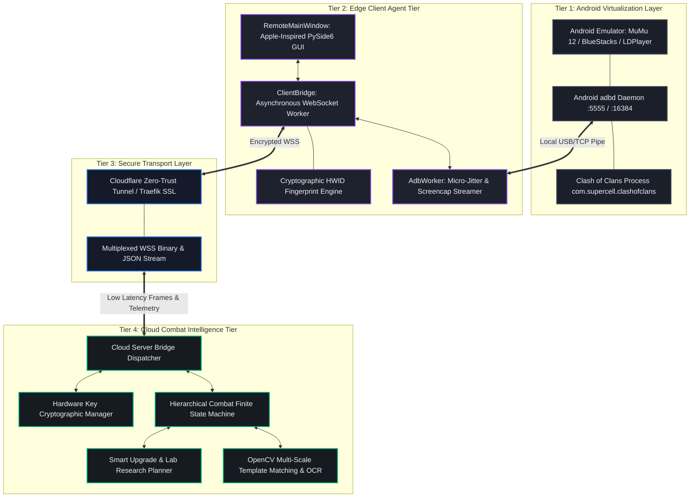
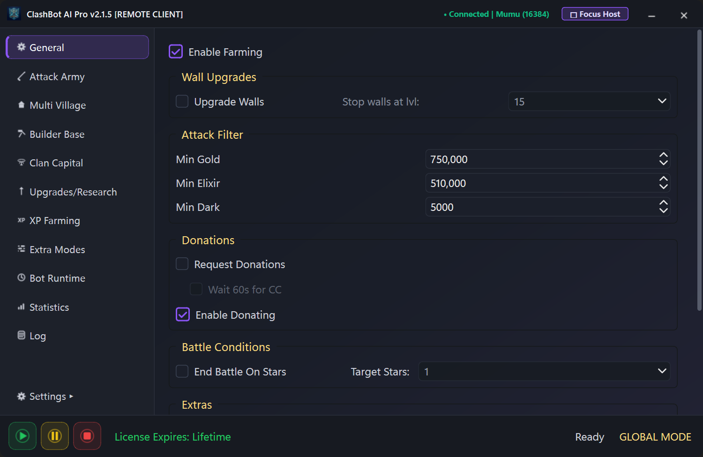

# ClashBot AI — Master Engineering Guide & Architectural Case Study

> **A Comprehensive Study Book on Distributed Game Intelligence, Zero-Knowledge Client Security, Anti-Detection Robotics, and Real-Time Computer Vision Pipelines**  
> **Author & Lead Architect**: Aradhye Tushar ([GitHub Profile](https://github.com/AradhyeTushar))  
> **Repository**: [daddyc00l69/clashbot-client](https://github.com/daddyc00l69/clashbot-client)  
> **Target Branch**: `case-study`  
> **License**: MIT License — Copyright (c) 2026 Aradhye Tushar. All rights reserved.

---

## 📖 Welcome to the ClashBot AI Study Book

**ClashBot AI** is an enterprise-grade distributed automation and computer vision intelligence platform engineered for mobile games. Unlike traditional game bots that ship monolithic binaries vulnerable to cracking and detection, ClashBot AI was designed from the ground up as a **Zero-Knowledge Decoupled System**.

This repository branch contains the complete **Case Study & Engineering Documentation Series**. All source code and proprietary combat engines remain private on cloud infrastructure; this repository serves as the definitive reference guide and study text for software engineers, security researchers, and robotics developers.

---

## 📚 Study Book Curriculum & Chapters

Explore the deep technical modules below:

| Chapter | Title | Key Engineering Concepts Covered |
| :---: | :--- | :--- |
| **[01](docs/01_SYSTEM_ARCHITECTURE.md)** | **[System Architecture & Topology](docs/01_SYSTEM_ARCHITECTURE.md)** | 4-Tier Topology, Sequence Flow, Microservices, Cloudflare Tunnel WSS |
| **[02](docs/02_ZERO_KNOWLEDGE_CLIENT_SECURITY.md)** | **[Zero-Knowledge Client Security](docs/02_ZERO_KNOWLEDGE_CLIENT_SECURITY.md)** | Threat Modeling, Decompilation Defense, Machine HWID, Ephemeral Leases |
| **[03](docs/03_EMULATOR_LIFECYCLE_AND_PORT_RESOLUTION.md)** | **[Emulator Auto-Discovery & Port Math](docs/03_EMULATOR_LIFECYCLE_AND_PORT_RESOLUTION.md)** | Registry Scanning, Mathematical Port Formulas ($16384+32i$), Auto-Bootstrapping |
| **[04](docs/04_ANTI_DETECTION_ROBOTICS.md)** | **[Anti-Detection Robotics](docs/04_ANTI_DETECTION_ROBOTICS.md)** | Gaussian Click Jitter ($\pm 1\text{--}3\,\text{px}$), Cubic Bézier Drags, Multitouch Pinch |
| **[05](docs/05_COMPUTER_VISION_AND_OCR_PIPELINE.md)** | **[Computer Vision & OCR Pipeline](docs/05_COMPUTER_VISION_AND_OCR_PIPELINE.md)** | Normalized Cross-Correlation ($R \ge \theta$), RAM JPEG Screencap ($<25\,\text{ms}$), OCR |
| **[06](docs/06_COMBAT_FINITE_STATE_MACHINE.md)** | **[Combat Finite State Machine](docs/06_COMBAT_FINITE_STATE_MACHINE.md)** | Hierarchical FSM, Funnel Cadence, E-Dragon / DragLoon / BARCH Archetypes |
| **[07](docs/07_NETWORKING_TELEMETRY_IPC.md)** | **[Networking, Telemetry & IPC](docs/07_NETWORKING_TELEMETRY_IPC.md)** | Binary Framing, Thread-Safe Qt Dispatching (`QThread`), `TCP_NODELAY` |
| **[08](docs/08_UI_UX_DESIGN_SPECIFICATION.md)** | **[UI/UX Design Specification](docs/08_UI_UX_DESIGN_SPECIFICATION.md)** | Apple-Inspired Dark Glassmorphism, 11-Page Control Matrix, Micro-Interactions |
| **[09](docs/09_CASE_STUDY_AND_ENGINEERING_LESSONS.md)** | **[Case Study & Engineering Lessons](docs/09_CASE_STUDY_AND_ENGINEERING_LESSONS.md)** | Bandwidth vs. Latency Trade-offs, Failure Recovery Watchdogs, Academic Questions |

---

## 🏛️ High-Level System Architecture

---

## 📸 Visual Showcase Gallery

### 1. Standalone Client with Live Telemetry
The client dashboard running independently on the edge PC, displaying live MuMu Player 12 connectivity (`• Connected | mumu (16384)`), low-latency cloud bridge status, and glowing cyber-violet styling.

---

### 2. General Automation & Wall Upgrades
Full control parity across all 66 checkboxes, dropdowns, and loot threshold spinboxes.

---

### 3. Tactical Attack Army Configuration
Multi-strategy attack selector supporting E-Dragon, DragLoon, Valkyrie, Totem/Thrower, and BARCH configurations.

---

### 4. Real-Time Loot Analytics & Efficiency Telemetry
Continuous real-time tracking of Gold, Elixir, and Dark Elixir farm rates, attack counters, and live star efficiency graphs.

---

### 5. Multi-Emulator Drawer & Configuration
Slide-out drawer allowing dynamic switching between MuMu Player, BlueStacks, LDPlayer, and Nox with instant ADB port resolution.

---

## 💡 Summary of Key Engineering Innovations

1. **Zero-Knowledge Security**: Shipped client software contains 0 algorithms and 0 templates, eliminating software piracy and reverse engineering vulnerabilities.
2. **Sub-25ms RAM Screencapping**: Direct pipe streaming (`adb exec-out screencap -p`) eliminates disk I/O, reducing screencap latency from $1400\,\text{ms}$ down to $<25\,\text{ms}$.
3. **Mathematical Port Resolution**: Automatic emulator detection via Windows Registry introspection and formula-based port binding ($\text{Port} = 16384 + 32 \times i$).
4. **Heuristic Anti-Detection**: Gaussian micro-jitter ($\pm 1\text{--}3\,\text{px}$) and cubic Bézier drag splines prevent behavioral anti-cheat pattern detection.
5. **Thread-Safe Architecture**: Non-blocking `QThread` workers with `QTimer.singleShot(0, ...)` event loop marshalling maintain 60 FPS UI responsiveness.

---

*Authored by **Aradhye Tushar** — Master Architecture & Engineering Study Book for ClashBot AI.*
