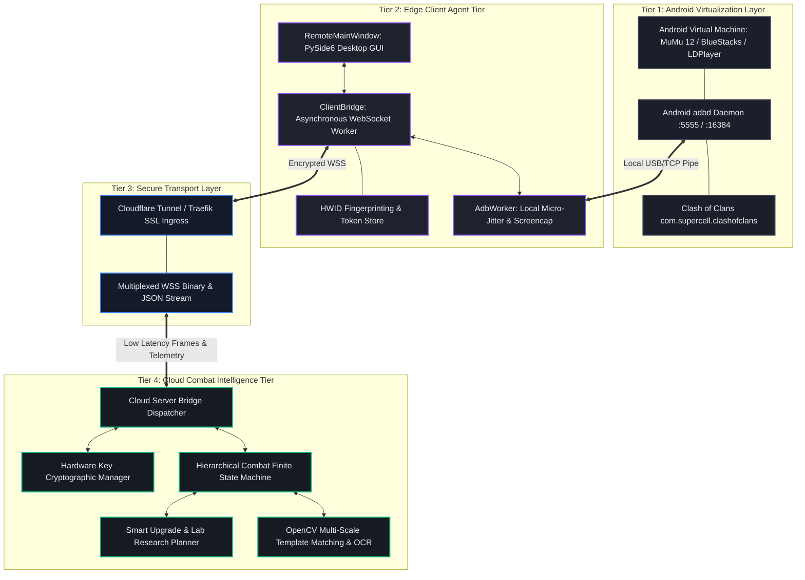
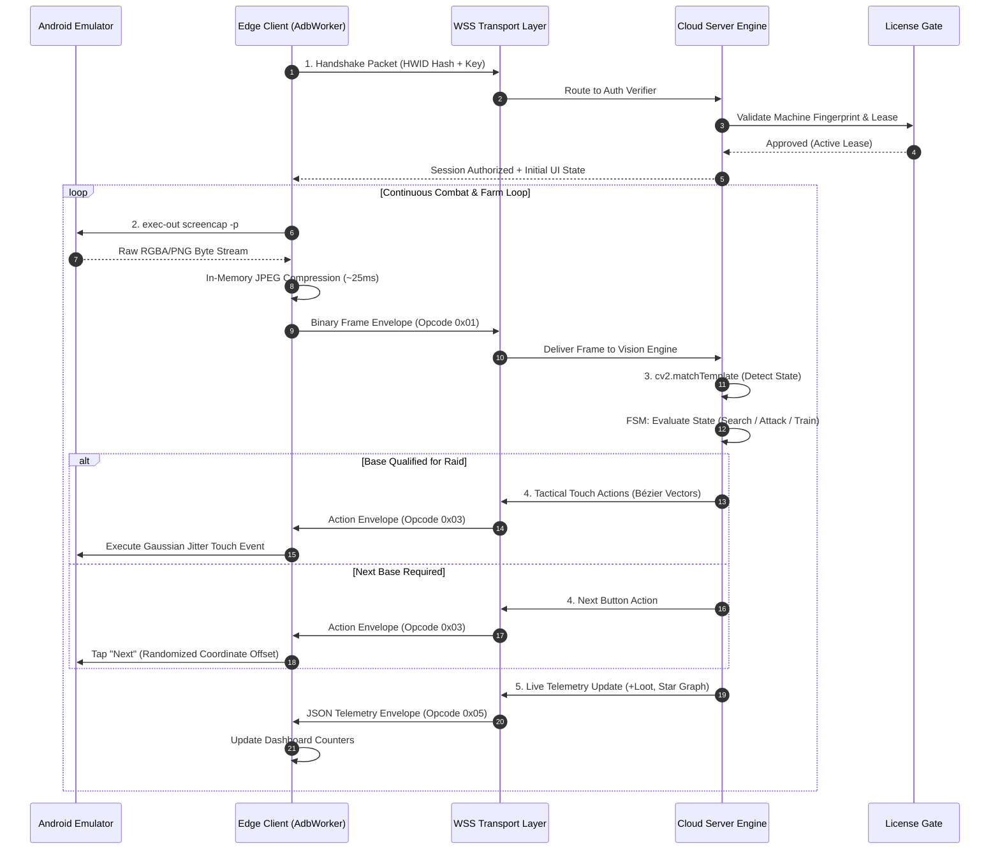

# Chapter 1: System Architecture & Topology

> **Part of the ClashBot AI Study Book Series**  
> **Topic**: Distributed System Topology, Four-Tier Architecture, and Execution Pipelines

---

## 1. Architectural Overview

ClashBot AI is engineered around a **distributed, decoupled four-tier topology**. Unlike traditional single-executable automation software, ClashBot AI isolates the **User Interface (Presentation)**, the **Android Virtualization Environment (Execution Target)**, the **Transport Bridge (Communication)**, and the **Combat & Computer Vision Engine (Intelligence)** into independent failure and security domains.

---

## 2. The Four Tiers Explained

### Tier 1: Android Virtualization Layer
- **Host System**: Runs on the user's local operating system (Windows 10/11 x64).
- **Virtualization Technologies**: Intel VT-x / AMD-V hypervisor acceleration.
- **Components**:
  - The Android emulator kernel and headless display server.
  - The Android Debug Bridge daemon (`adbd`) listening on a loopback TCP socket.
  - The target application package: `com.supercell.clashofclans`.

### Tier 2: Edge Client Agent Tier
- **Location**: Installed on the user's PC.
- **Responsibilities**:
  - Render an Apple-inspired desktop GUI with live health and telemetry monitors.
  - Capture framebuffers from the local Android VM via low-latency ADB memory pipes.
  - Compress framebuffers into lightweight JPEG streams ($<25\,\text{ms}$).
  - Transmit frames to Tier 4 and execute returned anti-detection touch vectors.
- **Security Posture**: Holds **zero** combat algorithms, **zero** coordinate maps, and **zero** image templates.

### Tier 3: Secure Transport Layer
- **Ingress Infrastructure**: Cloudflare Zero-Trust Tunnels (`https://clashbot.devtushar.uk`) and Traefik reverse proxies.
- **Protocol**: Single persistent WebSocket over TLS (`wss://`).
- **Features**:
  - Multiplexed channels: telemetry channel, UI action channel, frame video stream channel.
  - Frame packing using compact binary headers (1-byte opcode, 4-byte payload length).
  - Traverses symmetric NATs, university firewalls, and carrier-grade NATs without port forwarding.

### Tier 4: Cloud Combat Intelligence Tier
- **Location**: Hosted on private Linux VPS clusters (Docker / Wine / headless containers).
- **Responsibilities**:
  - Execute computer vision template matching (OpenCV NCC).
  - Read resource counters via OCR.
  - Execute the Hierarchical Finite State Machine (HFSM).
  - Manage user licenses, concurrency locks, and HWID challenge-response tokens.

---

## 3. End-to-End Execution Sequence

---

## 4. Key Takeaways for Students
1. **Separation of Concerns**: Isolate presentation completely from decision logic.
2. **Failure Isolation**: A network interruption on Tier 3 leaves the server bot state running cleanly without crashing the client UI.
3. **Bandwidth Optimization**: Only JPEG frames and discrete action envelopes cross the network; full game binaries and emulator disks never move.
