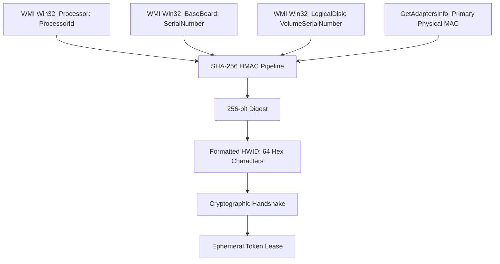

# Chapter 2: Zero-Knowledge Client Security & IP Protection

> **Part of the ClashBot AI Study Book Series**  
> **Topic**: Threat Modeling, Monolithic Bot Decompilation Flaws, and Cryptographic Hardware Fingerprinting

---

## 1. The Vulnerability of Monolithic Game Bots

Traditional game automation architectures bundle all components—GUI, combat heuristics, coordinate maps, visual templates, and licensing logic—into a single distributable binary:

```
[ Traditional Monolithic Bot: Highly Vulnerable ]
├── Executable (PyInstaller / PyArmor / C# / C++)
│   ├── Combat Logic (Attack algorithms, spell placement, hero timing)
│   ├── Computer Vision (PNG templates, village coordinates, OCR logic)
│   ├── Licensing Code (Local if-checks: if license_valid() == True)
│   └── Anticheat Bypass (Hardcoded offsets, static sleep timers)
```

### Attack Vectors on Monolithic Deployments:
1. **Bytecode Decompilation**: PyInstaller or Nuitka wrappers can be extracted using tools like `pyinstxtractor` and decompiled into readable Python via `uncompyle6` or `decompyle++`.
2. **Memory Inspection & Patching**: Attackers attach Cheat Engine or x64dbg to memory, locate the license evaluation instruction (`test eax, eax; jz invalid`), and patch it to an unconditional jump (`jmp`).
3. **Template Extraction**: Competitors dump transparent PNG assets and coordinate tables to clone the automation suite.
4. **MITM License Spoofing**: Simple HTTPS license servers can be intercepted via custom Root CA certificates, returning spoofed `{"valid": true}` JSON responses.

---

## 2. The ClashBot AI Zero-Knowledge Paradigm

ClashBot AI neutralizes all four attack vectors by stripping **100% of proprietary logic** from the client machine:

```mermaid
graph LR
    subgraph Client_Distribution [Untrusted Client Machine]
        GUI[Pure PySide6 Display Layer]
        Stubs[Lightweight Interface Stubs]
        AdbBridge[Local ADB Pipe & Capture]
        HWID[Machine Fingerprint Generator]
    end

    subgraph Cloud_Server [Trusted Server Cluster]
        FSM[Proprietary Combat Finite State Machine]
        Templates[Secret Visual Templates & CV Pipelines]
        CoordMaps[Village Dynamic Geometry Engine]
        LicAuth[Hardware Authentication Authority]
    end

    Client_Distribution ==="Encrypted WSS Pipe"===> Cloud_Server

    classDef c fill:#1B1F2A,stroke:#EF4444,stroke-width:2px,color:#ECEFF4;
    classDef s fill:#161B22,stroke:#10B981,stroke-width:2px,color:#ECEFF4;
    class GUI,Stubs,AdbBridge,HWID c;
    class FSM,Templates,CoordMaps,LicAuth s;
```

### Why Cracking Is Mathematically Impossible:
If an attacker decompiles or memory-dumps the client application:
- They find **no combat algorithms** to steal.
- They find **no OpenCV templates** to extract.
- Patching the local GUI to bypass the login dialog accomplishes nothing: the server refuses to establish a WebSocket tunnel or dispatch combat commands without a cryptographically valid server-side session token.

---

## 3. Cryptographic Hardware-Locked Licensing (HWID)

To guarantee single-seat licensing without false positives across Windows updates, ClashBot AI synthesizes a composite cryptographic hardware signature.



### The HWID Mathematical Generation Algorithm:
```python
def generate_machine_hwid(secret_salt: bytes) -> str:
    # 1. Query Hardware Unique Identifiers via WMI & Windows Win32 APIs
    cpu_id = get_wmi_property("Win32_Processor", "ProcessorId")
    mb_serial = get_wmi_property("Win32_BaseBoard", "SerialNumber")
    disk_id = get_volume_serial("C:\\")
    mac_addr = get_primary_mac_address()

    # 2. Canonicalize & Strip Whitespace
    raw_fingerprint = f"{cpu_id}:{mb_serial}:{disk_id}:{mac_addr}".strip().upper()

    # 3. Compute HMAC-SHA256
    return hmac.new(secret_salt, raw_fingerprint.encode("utf-8"), hashlib.sha256).hexdigest()
```

---

## 4. Ephemeral Frame Leases & Silent Telemetry

Authentication is not a one-time check during application launch. It is an active, continuous verification cycle:
1. **Challenge-Response on Handshake**: The server returns a cryptographically signed session ticket with an expiration timestamp.
2. **Frame Payload Verification**: Every video frame transmitted by the client includes the session ticket in its binary header.
3. **Silent Session Revocation**: If a license is revoked or concurrency limits are exceeded, the server stops acknowledging frame packets and closes the socket. The client cleanly returns to the login screen without crashing.

---

## 5. Security Checklist for Engineers
- [x] Zero templates stored on disk or memory on the edge.
- [x] Zero attack FSM rules stored locally.
- [x] Micro-pixel coordinate perturbation to prevent heuristic pattern recognition.
- [x] Ephemeral session tickets with strict 120-second lease windows.
