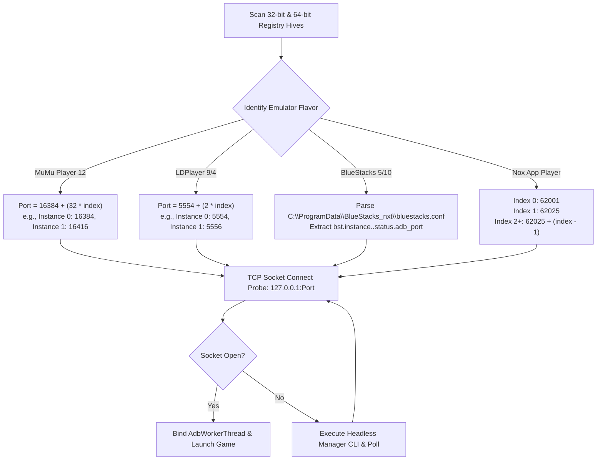

# Chapter 3: Android Emulator Auto-Discovery & Port Resolution

> **Part of the ClashBot AI Study Book Series**  
> **Topic**: Windows Registry Introspection, Mathematical Port Equations, and Automated Lifecycle Supervision

---

## 1. The Emulator Port Fragmentation Problem

Android emulators running on Windows do not bind ADB to a single static port. Each emulator brand and instance index calculates its local loopback port dynamically:

- **MuMu Player 12 / Pro**: Employs dynamic base offsets starting at port `16384`.
- **LDPlayer 9 / 4**: Follows standard Android emulator console offset formulas (`5554`, `5556`, ...).
- **BlueStacks 5 / 10**: Stores randomly assigned ports in a proprietary disk configuration file (`bluestacks.conf`).
- **Nox App Player**: Uses static non-sequential ports (`62001`, `62025`, `21503`).

Manual port entry by end users causes frequent connection failures and high support overhead. ClashBot AI resolves this through **Autonomous Registry Introspection** and **Dynamic Mathematical Port Resolution**.

---

## 2. Dynamic Mathematical Port Formulas



### 1. MuMu Player 12 / Pro Mathematical Formula
$$\text{Port}_{\text{MuMu}}(i) = 16384 + 32 \times i \quad \text{for instance } i \in \{0, 1, 2, \dots\}$$
- **Instance 0**: $16384 + 0 = 16384$
- **Instance 1**: $16384 + 32 = 16416$
- **Instance 2**: $16384 + 64 = 16448$
- **CLI Boot Command**:
  ```powershell
  MuMuManager.exe api -v <instance_index> launch_player
  ```

### 2. LDPlayer 9 / 4 Mathematical Formula
$$\text{Port}_{\text{LD}}(i) = 5554 + 2 \times i \quad \text{for instance } i \in \{0, 1, 2, \dots\}$$
- **Instance 0**: $5554 + 0 = 5554$
- **Instance 1**: $5554 + 2 = 5556$
- **CLI Boot Command**:
  ```powershell
  ldconsole.exe launch --index <instance_index>
  ```

---

## 3. Windows Registry Discovery Paths

To locate emulator installations without requiring user input, ClashBot AI queries both `HKEY_LOCAL_MACHINE` and `HKEY_CURRENT_USER`:

| Emulator Brand | Registry Hive & Key Path | Binary Key Name | Target Executable |
| :--- | :--- | :--- | :--- |
| **MuMu Player 12** | `SOFTWARE\Netease\MuMuPlayer-12.0` | `InstallDir` | `nx_main\MuMuManager.exe` |
| **BlueStacks 5** | `SOFTWARE\BlueStacks_nxt` | `InstallDir` | `HD-Player.exe` |
| **LDPlayer 9** | `SOFTWARE\XuanZhi\LDPlayer9` | `InstallDir` | `dnplayer.exe` |
| **Nox Player** | `SOFTWARE\BigNox\VirtualBox` | `InstallDir` | `Nox.exe` |

---

## 4. Lifecycle Supervision & Auto-Bootstrapping

When the client starts, `EmulatorWorker` executes the following supervisory loop:

1. **Process Inspection**: Check if the emulator process is running via `tasklist`.
2. **Socket Verification**: Attempt non-blocking TCP socket connection to `127.0.0.1:<calculated_port>`.
3. **Auto-Bootstrapping**: If closed, execute the emulator's native management CLI in the background.
4. **Boot Monitoring**: Poll `adb shell getprop sys.boot_completed` until the Android OS signals that initialization is complete.
5. **App Enforcement**: Issue `adb shell monkey -p com.supercell.clashofclans 1` to bring Clash of Clans into foreground focus.
