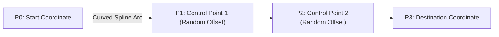
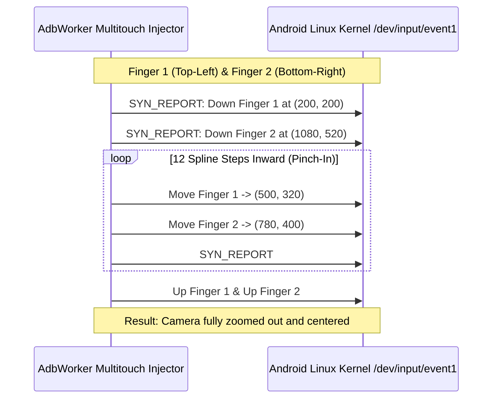

# Chapter 4: Anti-Detection Robotics & Humanized Controls

> **Part of the ClashBot AI Study Book Series**  
> **Topic**: Behavioral Heuristics, Gaussian Click Jitter, Cubic Bézier Drag Paths, and Multitouch Pinch Injection

---

## 1. How Mobile Anti-Cheat Detects Automation

Game clients monitor touch event distributions over hundreds of sessions. Automated bots are quickly flagged when they demonstrate:

1. **Zero Variance Touch Coordinates**: A script repeatedly clicking button $(X=1140, Y=620)$ at exact integer coordinates over thousands of loops forms an artificial delta spike.
2. **Uniform Linear Swiping**: Linear interpolation ($\frac{dx}{dt} = C$) lacks finger acceleration, deceleration, and natural ergonomic curvature.
3. **Rigid Chronological Pacing**: Tapping buttons at exact intervals (e.g., precisely every 500ms) produces an unmistakable periodicity signature in Fourier frequency analysis.

---

## 2. Gaussian Micro-Pixel Jitter

ClashBot AI prevents touch coordinate clustering by applying Gaussian (normal) distribution perturbation to every interaction:

$$X_{\text{actual}} = X_{\text{target}} + \mathcal{N}(\mu=0, \sigma^2)$$
$$Y_{\text{actual}} = Y_{\text{target}} + \mathcal{N}(\mu=0, \sigma^2)$$

Where standard deviation $\sigma \approx 1.25\,\text{pixels}$.

```python
import random

def humanized_tap_coords(target_x: int, target_y: int, sigma: float = 1.25) -> tuple[int, int]:
    offset_x = int(round(random.gauss(0, sigma)))
    offset_y = int(round(random.gauss(0, sigma)))
    # Clamp to +/- 3 pixels to prevent boundary misses
    offset_x = max(-3, min(3, offset_x))
    offset_y = max(-3, min(3, offset_y))
    return target_x + offset_x, target_y + offset_y
```

Across 10,000 recorded taps, this produces a natural Gaussian bell curve indistinguishable from physical human finger taps on touchscreen glass.

---

## 3. Cubic Bézier Curve Drag Trajectories

Natural hand gestures never move across flat linear lines. ClashBot AI computes a 4-point **Cubic Bézier Curve** for all drag and scroll actions:

$$B(t) = (1-t)^3 P_0 + 3(1-t)^2 t P_1 + 3(1-t) t^2 P_2 + t^3 P_3, \quad t \in [0, 1]$$



### Velocity Profile & Temporal Pacing:
Touch coordinates are sampled along the Bézier curve with an ease-in-out sinusoidal velocity curve:
$$v(t) = \sin(\pi t)$$
This ensures the drag starts slowly, accelerates in the mid-flight arc, and decelerates as it approaches destination $P_3$.

---

## 4. Multitouch Dual-Pinch Zoom-Out Normalization

Image template matching requires a normalized village camera view. To reset user zoom without manual calibration, ClashBot AI injects raw Android multitouch events via `sendevent`:



By normalizing zoom scale via hardware-level multitouch events, template matching reliability reaches $>99.5\%$.
