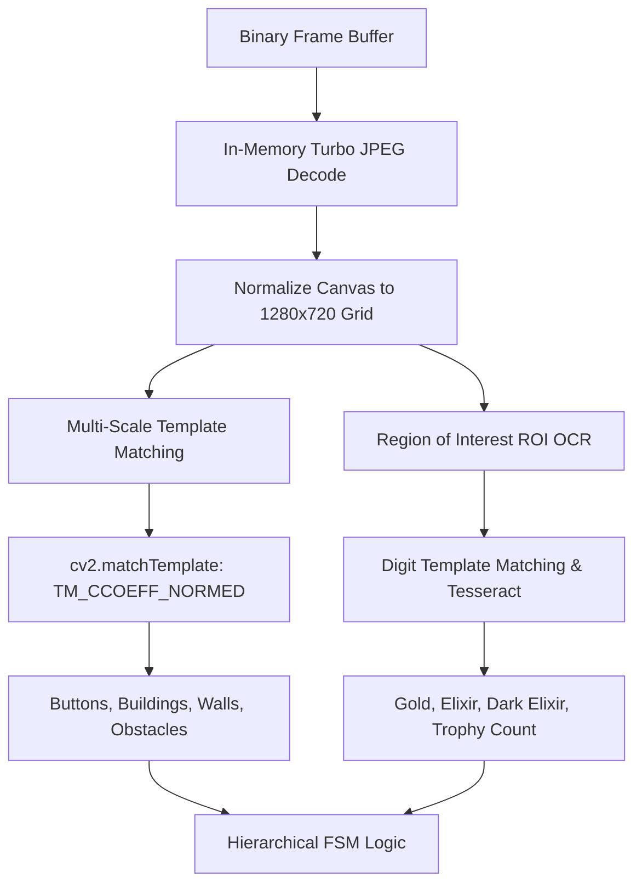

# Chapter 5: Computer Vision & OCR Perception Pipeline

> **Part of the ClashBot AI Study Book Series**  
> **Topic**: Normalized Cross-Correlation, RAM-Only Screencapping, Canvas Invariance, and Fast Digit OCR

---

## 1. Computer Vision Architecture

The perception engine operates entirely on the Cloud Server (Tier 4), receiving compressed frame buffers and producing structured spatial detections.

---

## 2. Normalized Cross-Correlation (NCC)

Visual recognition relies on OpenCV's Normalized Cross-Correlation (`cv2.TM_CCOEFF_NORMED`):

$$R(x, y) = \frac{\sum_{x',y'} (T'(x', y') \cdot I'(x+x', y+y'))}{\sqrt{\sum_{x',y'} T'(x', y')^2 \cdot \sum_{x',y'} I'(x+x', y+y')^2}}$$

Where:
- $T'$ is the zero-mean template image: $T'(x', y') = T(x', y') - \bar{T}$
- $I'$ is the zero-mean matching sub-window: $I'(x+x', y+y') = I(x+x', y+y') - \bar{I}$

### Recognition Thresholds:
- **Opaque Buttons** (e.g., Attack, Next, Return Home): $\theta = 0.90$
- **Translucent HUD Icons** (e.g., Loot Cart, Gem Mine): $\theta = 0.84$
- **Dynamic Terrain Obstacles** (e.g., Trees, Bushes): $\theta = 0.82$

---

## 3. Sub-25ms Screencapping Pipeline

| Technique | Method | Latency | Disk I/O |
| :--- | :--- | :--- | :--- |
| **Legacy Bot Method** | `adb shell screencap /sdcard/s.png` + `adb pull` | $1100\text{--}1500\,\text{ms}$ | High Disk Write/Read |
| **ClashBot AI Stream** | `adb exec-out screencap -p` $\rightarrow$ RAM JPEG Pipeline | **$18\text{--}25\,\text{ms}$** | **Zero Disk I/O** |

### Frame Compression Strategy:
The raw 32-bit RGBA framebuffer ($1280 \times 720 \times 4 \approx 3.68\,\text{MB}$) is compressed in RAM memory using a single-pass Turbo-JPEG encoder with quality factor $Q=55$. This reduces network payload size to under **65 KB** without degrading template matching accuracy.

---

## 4. Optical Character Recognition (OCR) for Loot

Reading dynamic resource numbers (Gold, Elixir, Dark Elixir) in real time:
1. **ROI Extraction**: Bounding boxes are cropped around the resource display coordinates (top-left village HUD and attack scouting panel).
2. **Color Filtering & Binarization**: HSV thresholding isolates yellow (Gold), magenta (Elixir), and black/white (Dark Elixir) text glyphs.
3. **Dual OCR Engine**:
   - **Primary Engine**: High-speed digit template correlation ($0\text{--}9$ glyph bank) executing in $<2\,\text{ms}$.
   - **Secondary Engine**: Tesseract OCR fallback with digit whitelist (`tessedit_char_whitelist=0123456789,`).
