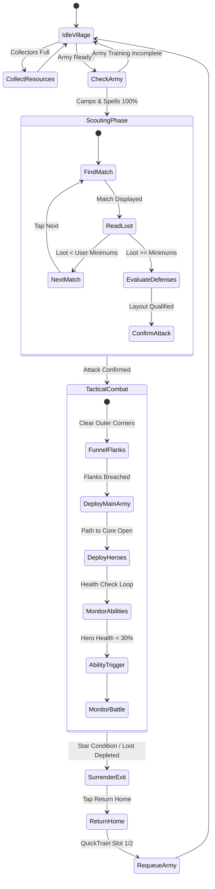

# Chapter 6: Hierarchical Combat Finite State Machine (HFSM)

> **Part of the ClashBot AI Study Book Series**  
> **Topic**: Hierarchical State Machines, Attack Pacing, Army Archetypes, and Multi-Mode Subsystems

---

## 1. Combat State Machine Architecture

ClashBot AI models all in-game behavior as a **Hierarchical Finite State Machine (HFSM)**. This ensures deterministic progression through raid sequences while allowing immediate recovery from interruptions (such as disconnects or maintenance breaks).

---

## 2. Tactical Attack Archetypes

### 1. Electro Dragon (E-Dragon) Funnel Strategy
- **Phase 1 (Funneling)**: Deploy two single E-Dragons on opposing perimeter corners to eliminate distracting non-defense structures.
- **Phase 2 (Main Charge)**: Deploy remaining E-Dragons in a tight line between the cleared corners, followed by the Grand Warden and Stone Slammer / Battle Blimp.
- **Phase 3 (Spell Cadence)**: Drop Rage Spells at 8-second intervals along the advance corridor; deploy Freeze Spells on single-target Inferno Towers and Air Sweepers.
- **Phase 4 (Hero Ability Timing)**: Activate Grand Warden's *Eternal Tome* as the air armada breaches the Town Hall core.

### 2. BARCH (Barbarian + Archer) Loot Stripping
- **Objective**: Cheap, maximum-efficiency resource extraction from dead bases with full exterior collectors.
- **Wave Distribution**: Ring deployment of Barbarians (tanks) followed immediately by an arc of Archers (DPS) targeting mines and collectors.
- **Early Surrender**: Surrender battle as soon as $50\%$ (1 Star) is achieved and collectors are empty, saving remaining troops.

---

## 3. Auxiliary Game Loops & Sub-FSMs

1. **Builder Base 2.0 Loop**:
   - Automated 2-stage battle execution.
   - Clock Tower activation and Gem Mine harvesting.
   - OTTO outpost upgrades and wall-ring leveling.
2. **Clan Capital Raid Weekend**:
   - Multi-hit district hall clearing.
   - Automatic Capital Gold forge collection.
3. **Goblin XP Farming Loop**:
   - Quick-surrender Goblin Picnic level loop for rapid account leveling without troop training downtime.
