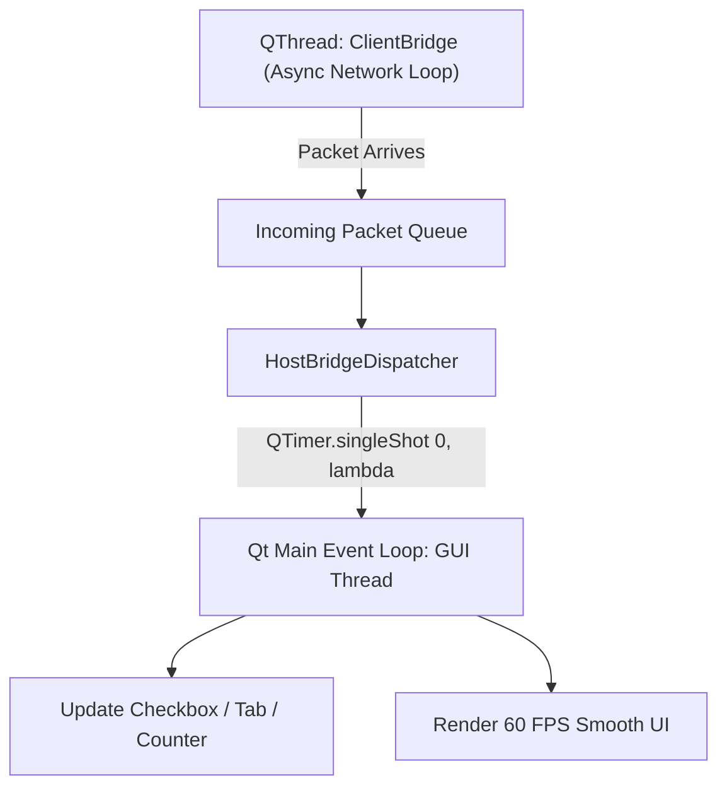

# Chapter 7: Low-Latency Networking, Telemetry & IPC

> **Part of the ClashBot AI Study Book Series**  
> **Topic**: WebSocket Multiplexing, Binary Wire Framing, Thread-Safe Qt Event Dispatching, and Real-Time Telemetry

---

## 1. Transport Layer Protocol Design

To ensure real-time command response ($<50\,\text{ms}$) while traversing firewalls and NAT barriers, ClashBot AI uses a multiplexed WebSocket protocol over TLS:

```
[ Binary Frame Wire Format ]
0                   1                   2                   3
0 1 2 3 4 5 6 7 8 9 0 1 2 3 4 5 6 7 8 9 0 1 2 3 4 5 6 7 8 9 0 1
+-+-+-+-+-+-+-+-+-+-+-+-+-+-+-+-+-+-+-+-+-+-+-+-+-+-+-+-+-+-+-+-+
|  Opcode (1B)  |              Payload Length (4B)              |
+-+-+-+-+-+-+-+-+-+-+-+-+-+-+-+-+-+-+-+-+-+-+-+-+-+-+-+-+-+-+-+-+
|                        Payload Data...                        |
+-+-+-+-+-+-+-+-+-+-+-+-+-+-+-+-+-+-+-+-+-+-+-+-+-+-+-+-+-+-+-+-+
```

### Protocol Opcode Specifications:
- `0x01 (MSG_FRAME)`: Compressed JPEG video buffer from client to server.
- `0x02 (MSG_STATE_SYNC)`: Complete widget state mapping (checkboxes, spinboxes, tabs).
- `0x03 (MSG_ACTION_DISPATCH)`: Touch/swipe commands to be executed on the emulator.
- `0x04 (MSG_LOG_STREAM)`: Live server console logs streamed to client's Log tab.
- `0x05 (MSG_TELEMETRY)`: Live farming metrics (hourly loot rate, stars, attack counts).
- `0x06 (MSG_HEARTBEAT)`: 5-second bidirectional keepalive ping/pong measuring latency.

---

## 2. Qt Thread Safety & Asynchronous Dispatching

In desktop applications built with PySide6 / PyQt, executing network communication or heavy calculations on the primary thread freezes GUI rendering.



### Thread Marshalling Pattern:
```python
from PySide6.QtCore import QTimer, QObject

class BridgeDispatcher(QObject):
    def dispatch_to_gui(self, action_callable):
        # Marshals callable onto Qt Main Event Loop safely
        QTimer.singleShot(0, action_callable)
```

### Reentrancy Guarding:
To prevent cyclical echo-loops (where receiving a checkbox update triggers an update signal back to the server), both endpoints wrap widget updates in an `_is_syncing` context:
```python
def set_checkbox_safe(self, widget, new_value):
    self._is_syncing = True
    try:
        widget.setChecked(new_value)
    finally:
        self._is_syncing = False
```

---

## 3. TCP Socket Tuning (`TCP_NODELAY`)

By default, the operating system enables Nagle’s algorithm, buffering small outbound packets for several milliseconds. ClashBot AI explicitly disables this:
```python
import socket

# Disable Nagle's algorithm for instantaneous touch dispatch
sock.setsockopt(socket.IPPROTO_TCP, socket.TCP_NODELAY, 1)
```
This guarantees sub-millisecond dispatch times for discrete touch action packets.
