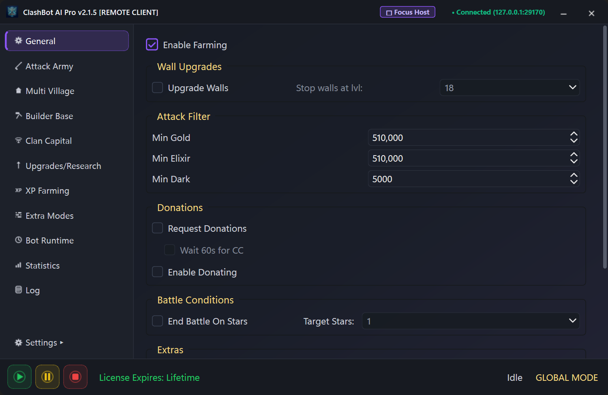
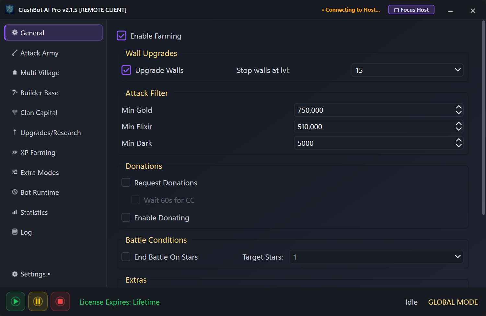
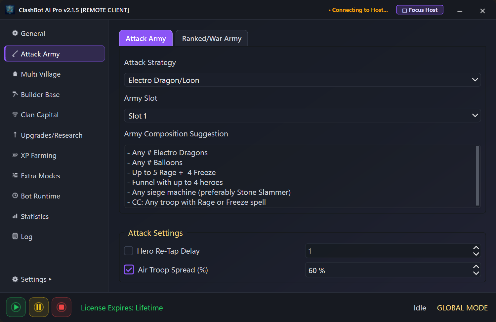
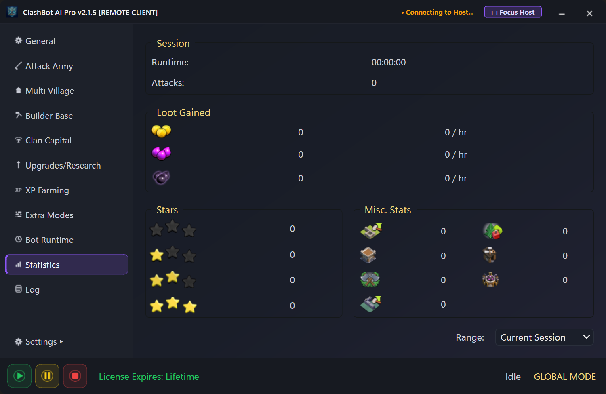
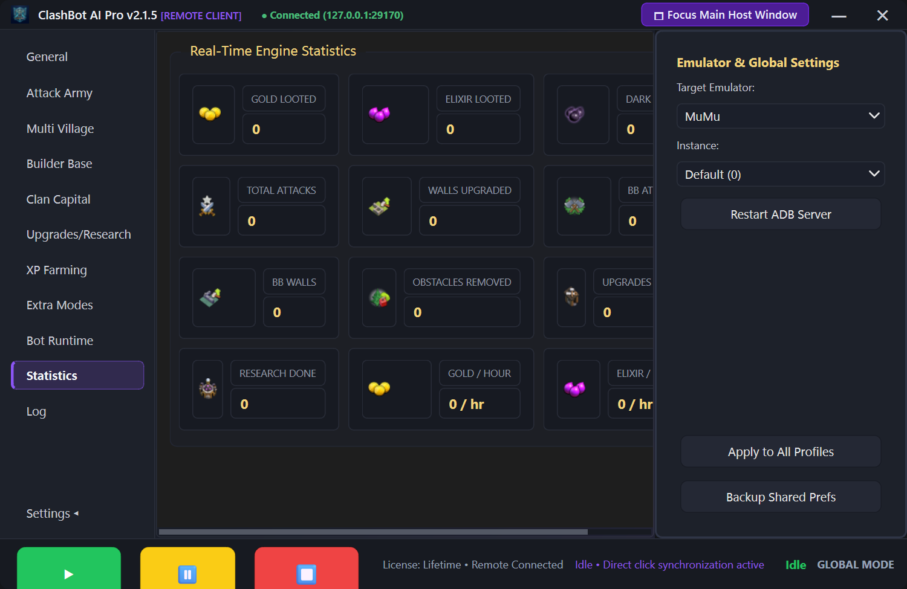

# Chapter 8: UI/UX Design System & Specification

> **Part of the ClashBot AI Study Book Series**  
> **Topic**: Apple-Inspired Aesthetic, Design Tokens, Micro-Interactions, and 11-Page UI Control Matrix

---

## 1. Visual Design Philosophy

ClashBot AI abandons the utilitarian, cluttered aesthetic common to traditional gaming bots in favor of an **Apple-inspired dark glassmorphic design system**.

```
Design System Color Palette:
├── Primary Accent:      #8B55F6 (Cyber Violet)
├── Hover Accent:        #9D6FF8 (Glowing Amethyst)
├── Window Surface:      #13161F (Deep Space Obsidian)
├── Elevated Card:       #1B1F2A (Frosted Charcoal)
├── Container Border:    #2E3440 (Subtle Slate Outline)
├── Emerald Online:      #10B981 (Connected Status Dot)
├── Crimson Offline:     #EF4444 (Disconnected Status Dot)
└── Typography:          -apple-system, "SF Pro Display", "Segoe UI", Roboto
```

---

## 2. Checkbox Micro-Interactions

Every checkbox across all 11 pages features refined modern styling:
- **Indicator Dimensions**: $16 \times 16\,\text{px}$ box with $4\,\text{px}$ rounded corners.
- **States**:
  - *Unchecked*: `#3A4253` border on dark `#1B1F2A` background.
  - *Hover*: $1.5\,\text{px}$ glowing `#8B55F6` purple border on `#222636` background.
  - *Checked*: Glowing `#8B55F6` border with custom high-definition purple SVG checkmark.
  - *Cursor*: Native pointing hand cursor (`Qt.PointingHandCursor`).



---

## 3. Complete 11-Page UI Specification

| Page # | Page Title | Key Functional Controls | Synchronized Controls |
| :---: | :--- | :--- | :--- |
| **01** | **General** | Enable Farming, Upgrade Walls, Min Gold/Elixir/Dark spinboxes, Clan Castle troop requesting. | 12 checkboxes, 2 comboboxes, 3 spinboxes |
| **02** | **Attack Army** | Quick Train strategy presets (E-Dragon, DragLoon, BARCH), hero priority order. | 8 checkboxes, 14 comboboxes |
| **03** | **Multi Village** | Multi-account rotation switcher, session duration limits, loot full switch triggers. | 4 checkboxes, 2 comboboxes, 2 spinboxes |
| **04** | **Builder Base** | Auto-attack, clock tower activation, gem mine collection, OTTO outpost upgrades. | 9 checkboxes, 4 comboboxes, 2 spinboxes |
| **05** | **Clan Capital** | Raid weekend automation, district prioritization, capital gold furnace claiming. | 5 checkboxes, 3 comboboxes |
| **06** | **Upgrades** | Village building upgrades, laboratory spell/troop priorities, pet house helper assignment. | 7 checkboxes, 6 comboboxes, 2 spinboxes |
| **07** | **XP Farming** | Goblin map quick-surrender loop, camp lightning zap farming, achievement auto-claimer. | 4 checkboxes, 2 comboboxes, 2 spinboxes |
| **08** | **Extra Modes** | Clan games challenge selector, ranked trophy pushing, weekly trader deals buyer. | 8 checkboxes, 8 comboboxes |
| **09** | **Bot Runtime** | Operational hour schedules, humanized break intervals, watchdog auto-restart timer. | 5 checkboxes, 6 spinboxes |
| **10** | **Statistics** | Real-time loot counters (Gold, Elixir, Dark), hourly run rate telemetry, attack star graphs. | Live snapshot polling & telemetry rendering |
| **11** | **Live Logs** | Real-time console log stream from cloud server, session event filters, auto-scroll toggle. | Streamed TCP log broadcasting |
| **Drawer**| **Settings** | Emulator instance selector, custom binary paths, server host URL, restart ADB daemon. | Real-time drawer toggle & command forwarding |

---

## 4. Visual Verification Gallery

### General Automation Page


### Attack Army Configuration


### Real-Time Statistics & Hourly Telemetry


### Multi-Emulator Settings Drawer

