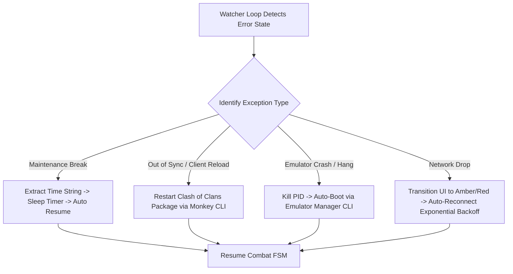

# Chapter 9: Engineering Case Study, Trade-offs & Research Questions

> **Part of the ClashBot AI Study Book Series**  
> **Topic**: Architectural Trade-Offs, Failure Recovery Watchdogs, and Academic Research Questions

---

## 1. Architectural Trade-Offs Analyzed

When engineering distributed automation systems, developers face critical design trade-offs:

### Trade-off 1: Frame Streaming vs. Client-Side Edge Inference
- **Approach A (Edge Inference)**: Distribute the OpenCV templates and model weights to the client machine; stream only detected state numbers to the server.
  - *Advantage*: Minimal network bandwidth ($<10\,\text{KB/s}$).
  - *Disadvantage*: Total vulnerability to reverse engineering. Attackers can extract templates and clone the bot in minutes.
- **Approach B (ClashBot AI Cloud Frame Streaming)**: Stream compressed JPEG frames ($<25\,\text{ms}$, $\sim 65\,\text{KB}$) to the cloud; execute 100% of vision on private servers.
  - *Advantage*: Absolute IP security and zero local attack surface.
  - *Trade-off*: Higher outbound client bandwidth ($\sim 150\text{--}300\,\text{KB/s}$).

### Trade-off 2: Standard ADB vs. Rooted Linux Kernel Input Injection
- **Approach A (Kernel Input Events)**: Injecting raw binary events into `/dev/input/event` bypasses ADB shell overhead ($<3\,\text{ms}$ tap latency).
  - *Disadvantage*: Requires Android root access, which trips modern integrity APIs (Google Play Protect / SafetyNet).
- **Approach B (ClashBot AI ADB Pipes)**: Standard loopback ADB commands with Gaussian perturbation.
  - *Advantage*: Works identically across all stock emulators without requiring root or custom ROMs.

---

## 2. Edge Case Recovery & Watchdog Mechanisms

Autonomous systems must self-heal when unexpected events occur:

1. **Maintenance Break Detection**: The vision engine recognizes the maintenance dialog, extracts the countdown timer via OCR, and suspends operations until the servers reopen.
2. **"Another Device Connected" Intercept**: Automatically yields execution for human play and retries after a configured cool-down period.
3. **Deadlock Watchdog**: If no frame state change is detected for 180 consecutive seconds during combat, the watchdog forcefully reloads the app to clear frozen animation loops.

---

## 3. Academic Research Questions for Learners

For university students, software engineers, and security researchers studying this system:

1. **Information Security**: If an attacker intercepts the encrypted WebSocket tunnel using a rogue proxy, what information can they deduce solely from packet timing and payload sizes without breaking TLS encryption?
2. **Distributed Systems**: How would you modify the Tier 4 cloud architecture to scale from 10 concurrent bot sessions to 10,000 concurrent sessions while minimizing OpenCV CPU core saturation?
3. **Computer Vision**: Under what visual conditions (dynamic weather effects, translucent seasonal obstacles) does Normalized Cross-Correlation fail, and how could a lightweight YOLO or MobileNet model replace template matching?
4. **Behavioral Heuristics**: What statistical tests (e.g., Kolmogorov-Smirnov test, Chi-Square uniformity test) could a game developer deploy on server-side click logs to differentiate Gaussian-jittered synthetic taps from organic human touches?
